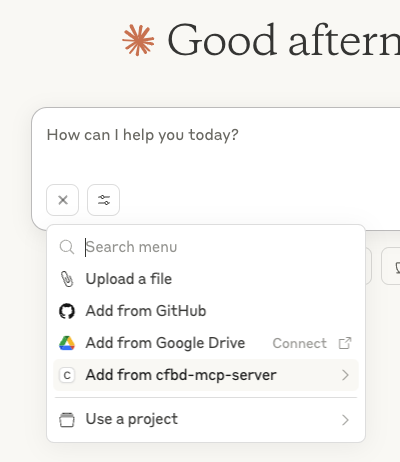

# College Football Data MCP Server

An MCP server implementation providing access to college football statistics sourced from the [College Football Data API V2](https://collegefootballdata.com/) within [Claude Desktop](https://claude.ai/download).

[](https://www.python.org/downloads/)
[](https://apinext.collegefootballdata.com/s)
[](LICENSE)
[](https://smithery.ai/server/cfbd)


## Overview

This Model Context Protocol (MCP) server enables AI assistants and applications to:

- Query comprehensive college football statistics and data
- Access game results, team records, and player statistics
- Analyze play-by-play data and drive summaries
- View rankings and win probability metrics
- Compare team performances and generate insights

Users can run queries using natural language.

## Sample output

**Q. What was the largest upset among FCS games during the 2014 season?**

A. Let me help find the biggest FCS upset from 2014. I'll look through the games data, focusing on games between FCS teams where there was a significant gap in team strength and an unexpected outcome.

The data suggests there were several notable upsets in FCS during 2014, but one that stands out was Eastern Washington defeating Washington 52-59 on September 6th, 2014. This was particularly significant because:

1. Washington was an FBS team from the Pac-12 conference
2. The game was played at Washington's home stadium (Husky Stadium)
3. Eastern Washington's win probability was only 1.4% according to the post-game stats
4. The 59 points Eastern Washington scored was the most ever by an FCS team against a Pac-12 opponent
5. Washington had been favored by multiple scores going into the game

Other notable FCS upsets from that season included:

- North Dakota State defeating Iowa State 34-14
- Bethune-Cookman defeating FIU 14-12
- Northern Iowa nearly upsetting Iowa (lost 31-23)

However, Eastern Washington over Washington appears to be the largest upset of the 2014 FCS season when considering:

- The difference in divisions (FCS vs FBS)
- The caliber of the FBS opponent (Power 5 conference)
- The scoring margin and offensive performance by the underdog
- The historical significance as one of the highest-scoring FCS wins over a Power 5 team
- The fact it happened on the road in a hostile environment 

## Prerequisites

- Python 3.11 or higher
- [UV package manager](https://docs.astral.sh/uv/) (recommended)
- A College Football Data API key ([get one here](https://collegefootballdata.com/key))

## Installation

### Installing via Smithery

To install College Football Data Server for Claude Desktop automatically via [Smithery](https://smithery.ai/server/cfbd):

```bash
npx -y @smithery/cli install cfbd --client claude
```

1. Clone this repository:
```bash
git clone https://github.com/yourusername/cfbd-mcp-server
cd cfbd-mcp-server
```

2. Create and activate a virtual environment:
```bash
uv venv
source .venv/bin/activate  # On Windows: .venv\Scripts\activate
```

3. Install dependencies:
```bash
uv pip install -e .
```

4. Create a `.env` file in the project root and add your API key:
```bash
CFB_API_KEY=your_api_key_here
```

### Manual Installation

1. Clone this repository:
```bash
git clone https://github.com/yourusername/cfbd-mcp-server
cd cfbd-mcp-server
```

2. Create and activate a virtual environment:
```bash
uv venv
source .venv/bin/activate  # On Windows: .venv\Scripts\activate
```

3. Install dependencies:
```bash
uv pip install -e .
```

4. Create a `.env` file in the project root and add your API key:
```bash
CFB_API_KEY=your_api_key_here
```

## Usage

### Running the Server

Start the server:
```bash
uv run cfbd-mcp-server
```

### Connecting with Claude Desktop

1. Open your Claude Desktop configuration at:
   - macOS: `~/Library/Application Support/Claude/claude_desktop_config.json`
   - Windows: `%APPDATA%\Claude\claude_desktop_config.json`

2. Add the server configuration:
```json
{
    "mcpServers": {
        "cfbd-mcp-server": {
            "command": "uv",
            "args": [
                "--directory",
                "/full/path/to/cfbd-mcp-server",
                "run",
                "cfbd-mcp-server"
            ],
            "env": {
                "CFB_API_KEY": "xxx",
                "PATH": "/full/path/to/python"
            }
        }
    }
}
```

3. Close then restart Claude Desktop

Once you restart you can confirm the installation by clicking on the plus sign in the lower left corner of the text box. If successful you'll see "Add from cfbd-mcp-server" as one of the menu options. Here's an example screenshot.



## Updating after install

1. Download the updated files
```
cd cfbd-mcp-server
git pull
```

2. Uninstall the existing package:
```
uv pip uninstall cfbd-mcp-server
```

3. Delete existing build artifacts and metadata

**For Windows:**
```
rmdir /s /q build dist
del /s /q *.egg-info
```

**For macOS:**
```
rm -rf build dist *.egg-info
```


4. Install the revised package and its dependencies
```
uv pip install -e .
uv sync --dev --all-extras
```

5.
```
uv run cfbd-mcp-server
```

6. Close and restart Claude Desktop

## Features

### Resources

Access schema documentation for all endpoints:

- `schema://games` - Game information and scores
- `schema://records` - Team season records
- `schema://games/teams` - Detailed team game data
- `schema://plays` - Play-by-play information
- `schema://drives` - Drive summaries and results
- `schema://play/stats` - Individual play statistics
- `schema://rankings` - Team rankings across polls
- `schema://metrics/wp/pregame` - Pregame win probabilities
- `schema://game/box/advanced` - Advanced box score statistics

### Tools

Query endpoints directly:

- `get-games` - Retrieve game data
- `get-records` - Get team records
- `get-games-teams` - Access team game statistics
- `get-plays` - Query play-by-play data
- `get-drives` - Analyze drive information
- `get-play-stats` - View play statistics
- `get-rankings` - Check team rankings
- `get-pregame-win-probability` - See win probabilities
- `get-advanced-box-score` - Access detailed game statistics and analytics

### Prompts

Pre-built analysis templates:

- `analyze-game` - Get detailed analysis of a specific game
- `analyze-team` - Comprehensive single team analysis
- `analyze-trends` - Analyze trends over a season
- `compare-teams` - Compare performance of two teams
- `analyze-rivalry` - Analyze historical rivalry matchups

## API Limits

The College Football Data API is free to use but has rate limiting:

- Free tier: Limited requests per minute
- [CFBD Patreon subscribers](https://www.patreon.com/collegefootballdata) get higher rate limits
- Use efficient querying patterns to avoid hitting limits
- Handle rate limit errors gracefully

## Development

### Project Structure

```
cfbd-mcp-server/
├── README.md
├── pyproject.toml
└── src/
    └── cfbd_mcp_server/
        ├── .env
        ├── __init__.py
        ├── cfbd_schema.py
        ├── schema_helpers.py
        └── server.py
```

### Setting Up for Development

1. Clone the repository
2. Install development dependencies:
```bash
uv pip install -e ".[dev]"
```

3. Run tests:
```bash
pytest
```

### Contributing

1. Fork the repository
2. Create a feature branch
3. Commit your changes
4. Push to your fork
5. Submit a pull request

## Troubleshooting

### Common Issues

1. **API Key Errors**
   - Verify your API key is correctly set in both the `.env` and `claude_desktop_config.json` files
   - Check the key is valid at collegefootballdata.com

2. **Rate Limiting**
   - Space out requests when possible
   - Consider Patreon subscription for higher limits
   - Implement caching for frequently accessed data

3. **Connection Issues**
   - Verify internet connectivity
   - Check API status at collegefootballdata.com
   - Ensure proper error handling in your code

### Getting Help

- Open an issue on GitHub
- Review the [API documentation](https://apinext.collegefootballdata.com/)
- Check the [College Football Data Discord](https://discord.gg/cfbdata)

## License

This project is licensed under the MIT License - see the [LICENSE](LICENSE) file for details.

## Acknowledgments

- [College Football Data](https://collegefootballdata.com/) for providing the API
- [Model Context Protocol](https://modelcontextprotocol.io) for the MCP specification
